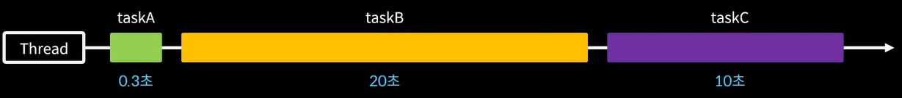
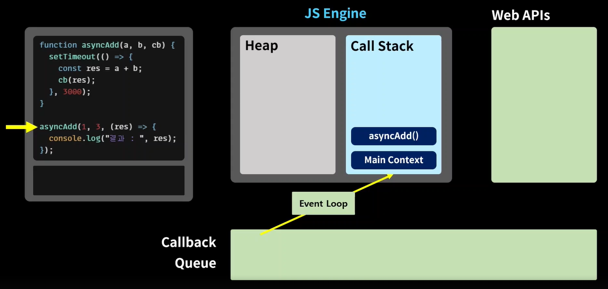

# ✏**2. 자바스크립트 응용**
챕터별 실습 소스는 실습폴더 내부 js 파일을 통해 확인할 수 있습니다. 

<br>

**2장에서 다룰 내용**
1. ️Truthy & Falsy
2. 삼항 연산자
3. 단락회로 평가
4. 조건문 업그레이드
5. 비 구조화 할당
6. Spread 연산자
7. 동기 & 비동기
8. Promise - 콜백 지옥에서 탈출하기
9. async & wait - 직관적인 비 동기 처리 코드 작성하기
10.  API 호출하기

<br>

---

**1. Truthy & Falsy?** 


*JavaScript*에서 참 같은 값(Truthy)인 값이란 불리언을 기대하는 문맥에서 true로 평가되는 값이고 반대로
거짓 같은 값(Falsy)란 Boolean을 기대하는 문맥에서 거짓으로 평가되는 값

**✔ 참 같은 값**
``` javascript
if (true)  
if ({})
if ([])
if (42)
if ("0")
if ("false")
if (new Date())
if (-42)
if (12n)
if (3.14)
if (-3.14)
if (Infinity)
if (-Infinity)
```

**✔ 거짓 같은 값**
```javascript
let value ; // 선언만 하는 경우 undefined 할당 
let undefinedValue = undefined // 위와 같은 값이 할당
let nullValue = null;
let boolValue = false;

let zero = 0;
let notNumber = NaN;

let emptyStr = '';
let emptyStr = "";
```
자바스크립트가 위와 같은 형식의 데이터를 `True,False`로 판단하는 이유는 조건문 및 논리 연산에서 간편한 사용을 하기 위함

<br>

**활용 예제**
```javascript
let b = [];  // 빈 배열
if(b)  {
	console.log("TRUE");   // "TRUE" 출력
} else {
	console.log("FALSE");
}

let a = "";
if(a)  {
    console.log("TRUE");
} else {
    console.log("FALSE");  // "FALSE" 출력
}
```
위처럼 참 같은 값과 거짓 같은 값을 조건문 사용 시 boolean 형식의 데이터로 처리 할 수 있음

</br>

**정리**
- false,undefined,null,0,NaN,빈문자열("",'')를 제외하면 모두 Truthy 값
- 조건문 작성 시 Truthy와 Falsy 개념을 이해하고 활용한다면 코드를 간결하게 작성할 수 있음

---
**2. 삼항 연산자?** </br>
*삼항 연산자*는 JavaScript에서 조건문을 간결하게 처리할 수 있는 테크닉 중 하나, 
이를 활용하면 간단한 ```if.. else```문을 더욱 간결하게 표현할 수 있음

**기본 문법**
```
condition(조건식) ? exprIfTrue(참일때 실행하는 로직) : exprIfFalse(거짓일때 실행하는 로직);
```
코드를 직접 만들어 써보는게 가장 쉽게 익힐 수 있음

<br>


**활용 예제**
```javascript
let age = 30;
let birthDayMessage = (age > 30) ? "생신 축하드립니다!" : "생일 축하해요!";

// 삼항연산자를 모른다면
let birthDayMessage;
if(age > 30){
    birthDayMessage = "생신 축하드립니다!";
} else {
    birthDayMessage = "생일 축하해요!";
}
```
위 코드에서 ```if/else``` 구문을 삼항연산자를 활용하면 위처럼 한줄에 처리할 수 있음

<br>

아래 코드는 많은 중첩이 필요한 코드를 기존 `if-else`와 `논리 연산자` 를 사용해 비교한 코드
```javascript
// 삼항연산자 사용 중첩코드
function makeMessage(age){
    return age >= 60 ? "어르신 생신 축하드려요!" 
        :  age >= 50 ? "생신 축하드려요!"
        :  age >= 40 ? "..."  : "else 구문";
}

// 기존 if-else
function makeMessage(age){
    if(age >= 60) {return "어르신 생신 축하드려요!"}
    else if(age >= 50) { return "생신 축하드려요!"}
    else if(age >= 40) { return "..."}
}
```
위 두 함수는 동일한 메시지를 리턴하는 함수지만 많은 중첩이 필요한 로직의 경우 기존 `if-else`가 코드가 더 직관적임

<br>

**정리**
- 사실 삼항연산자를 몰라도 ```if-else``` 구문으로 처리할 수 있음, 하지만 이를 잘 활용한다면 코드를 더 간결하게 사용할 수 있음
- 삼항 연산자도 복잡한 로직의 조건문을 표현할 수 있지만 ```if-else``` 코드가 더 직관적이라 생각함
---

**3. 단락회로 평가** 

 단락회로 평가는 왼쪽에서 오른쪽에서 연산하게 되는 논리연산자의 연산 순서를 이용하는 문법

```javascript
// && 연산자는 왼쪽 오른쪽 값이 모두 참일때 true를 리턴
console.log(false && true); // 만약 왼쪽 값이 false라면 오른쪽 true를 확인하지 않음

// || or 연산자는 두 값중 하나라도 true라면 true를 리턴
console.log(ture || false); // 만약 왼쪽 값이 true라면 오른쪽 false를 확인하지 않음
```

위와 같이 논리연산자의 두번째 피연산자를 확인하지 않고 연산을 끝내는것을 **단락회로 평가**라 부름

<br>

**활용 예제**</br>
단락회로 평가를 활용해 아래와 같이 코드를 작성할 수 있음
```javascript
const getName = (person) => {
	const name = person && person.name;
	return name || "객체가 아닙니다.";
}

let person ; // "객체가 아닙니다.";  or {name : "김준현"}; // 두 케이스 모두 처리 가능
const name = getName(person);
console.log(person); // "객체가 아닙니다." or "김준현"
```
단락회로 평가를 사용하지 않으면 위 코드에 person의 값에 undefined가 할당된다면 person.name에 접근 시 에러가 발생함 </br> 
하지만 && 단락회로 평가와 truthy & falsy 속성을 활용하면 위 코드는 아래와 같은 순서로 동작 
1. person의 값은 undefined(falsy) 속성을 갖게 되어 name의 값엔 undefined가 할당
2. return 문에선 || 연산자로 인해 뒷 문자열인 "객체가 아닙니다." 가 리턴(truthy 속성)  
3. 최종 "객체가 아닙니다"가 출력

<br>

**정리**
- 단락회로 평가는 논리연산자의 연산 순서(왼쪽에서 오른쪽으로 연산)를 이요하는 문법
- 단락회로 평가를 활용해 데이터의 비정상적인 값을 생각하며 코드를 작성할 수 있음

---
**4. 조건문 업그레이드**


조건문을 응용해서 사용할 수 있는 테크닉에 대한 내용
<br></br>
**활용 예제**</br>
```javascript
function isKoreanFood(food){
    if(food === "불고기" || food === "비빔밥" || food ==="떡볶이"){
         return true;
    } 
    return false;
}

// 상단(적용전), 하단(적용후)
// 위와 동일한 로직의 코드
function isKoreanFood(food){
    if(["불고기","떡볶이","비빔밥"].includes(food)){
         return true;
    } 
    return false;
}
```
배열의 includes 내장 함수를 활용해 if || if 를 직관적으로 개선해 사용

```javascript
const meal = {
	한식 : "불고기",
	중식 : "멘보샤",
  일식 : "초밥",
  양식 : "스테이크",
  인도식 : "카레"
};
const getMeal =(mealType) => {
		return meal[mealType]  || "굶기"
}

console.log(getMeal("한식")); // "불고기";
console.log(getMeal("미국식")); // "굶기";
```
meal 객체를 활용해 if문을 더욱 간결하게 표현할 수 있음

<br>

**정리**
- 배열을 활용하는 방식과 객체를 활용해 if문을 간결하게 사용하는 방식 지향
---
**5. 비구조화 할당**


배열이나 객체를 더 효과적으로 사용할 수 있는 테크닉

**✔변수 비구조화 적용 전**
```javascript
let arr =["one","two","three"];

let one = arr[0];
let two = arr[1];
let three =arr[2];
console.log(one,two,three);
```
일반적으로 배열의 내부 값을 변수에 할당하기 위해선 위와 같은 코드를 작성한다. 하지만 비구조화 할당 개념을 적용하면 한줄의 코드로 끝낼 수 있음, 아래 코드는 동일한 코드

**✔변수 비구조화 적용 후**
```javascript
let arr =["one","two","three"];
let [one,two,three] = arr;
console.log(one,two,three) // one two three 출력

// 기본값 추가 방식
let [one,two,three,four = "four"] = ["one","two","three"]; // four ="four" 형식을 이용해 기본값을 줄 수도 있음
console.log(one,two,three,four); // one,two,three,four 출력 , 
```
대괄호를 이용해서 배열의 값을 순서대로 할당받아 사용하는 방식을 **배열의 비구조화 할당**이라 함


<br>

이를 활용해 값의 위치를 바꾸는 Swap도 간단하게 할 수 있음
```javascript
let a = 10;
let b = 20;
[a,b] = [b,a]; 
```
한줄로 a,b 변수의 값이 Swap된다. <br>
동작 순서는 비구조화 할당으로 b의 값(20)과 a의 값(10)이 a,b 변수에 할당

<br>

비구조화 할당을 이용해 객체의 값에도 할당할 수 있음 


**✔객체 값에 비구조화 적용 전**
```javascript
let object = {one: "one", two:"two", three:"three"};
let one = object.one;
let two = object.two;
let three = object.three;
```
원래라면 객체의 프로퍼티 값을 할당하기 위해선 적용 전 코드처럼 하나씩 꺼내 세팅 <br></br>
**✔객체 비구조화 적용 후**
```javascript
let object = {one: "one", two:"two", three:"three"};
let {one, two, three} = object;
console.log(one,two,three);
```
객체 비구조화를 이용해 한줄의 코드로 값을 할당
오브젝트의 키값을 기준으로 매핑되는 프로퍼티 값을 각각의 변수에 할당(순서가 아닌 키값을 기준으로 비구조화 할당 발생)

<br>

**정리**
- 비구조화는 배열 또는 객체의 값을 편리하게 할당하는 기술
- 비구조화 할당은 앞으로 리액트에서 매우 자주 사용하게 될 개념임

---
**6. Spread 연산자** </br>
객체를 다루는 다른 방법인 **Spread 연산자** </br>
**✔Spread 개념을 모르는 개발자 코드**</br>
```javascript
const cookie = {
    base : "cookie",
    madeIn : "korea"
};

const chochochipCookie = {
    base : "cookie",
    madeIn : "korea",
    toping : "chocochip"
};

const blueberryCookie = {
     base : "cookie",
     madeIn : "korea",
     toping : "blueberry" 
}
```
위 객체들은 중복된 키와 프로퍼티인 `base : "cookie", madeIn:"korea"` 정보가 모든 객체마다 들어가 있는데 이를 효과적으로 처리할 수 있는 스킬이 Spread 연산자

**✔Spread 개념을 적용한 코드**
```javascript
const cookie = {
    base : "cookie",
    madeIn : "korea"
};

const chochochipCookie = {
    ...cookie,
    toping : "chocochip"
};

const blueberryCookie = {
    ...cookie, 
    toping : "blueberry" 
}
```
`...cookie` 를 Spread 연산자라 하며 이를 이용하면 중복된 객체의 요소를 편리하게 추가할 수 있음

<br>

이를 이용해 다음과 같이 또 다른 방식으로 유용하게 사용할 수 있음
```javascript
const noTopingCookies =["촉촉한쿠키", "안촉촉한쿠키"];
const topingCookies = ["바나나쿠키","블루베리쿠키","딸기쿠키"];
const allCookies = [...noTopingCookies,...topingCookies]; // 출력 [ '촉촉한쿠키', '안촉촉한쿠키', '바나나쿠키', '블루베리쿠키', '딸기쿠키' ]

```
Spread 연산자를 이용하면 객체의 프로퍼티를 펼치는 것처럼 배열의 원소를 순서대로 펼칠 수 있음

<br>

**정리**
- Spread 연산자를 활용하면 중복된 객체의 요소를 편리하게 처리할 수 있음
- Spread 연산자 뿐만 아니라 중간에 실제 프로퍼티 값을 사용할 수 있음

---

**7. 동기 & 비동기**

이번 내용은 **자바스크립트가 동작하는 방식**에 대한 내용으로 개인적으로 가장 중요한 파트 중 하나라 생각하며 확실히 이해하기 위해 상세히 작성하겠음

**시작하기 전에**

동기 비동기를 다루기전에 알아야 할 `프로세스`와 `스레드`기본 개념에 대해 보겠다.

✔ *프로세스 VS 스레드*
```markdown
프로세스 : 독립적인 메모리 공간을 갖고, 각각이 독립적으로 실행되는 프로그램의 인스턴스
스레드 : 프로세스가 할당 받은 자원을 이용하는 실행의 단위, 프로세스 내에 생김
-> 정의는 솔직히 잘 와닿지 않는다, 예시를 통해 이해해보자

ex) : 브라우저에서 인터넷 강의를 음소거 해놓고 유튜브 영상을 보고 있다고 생각해보자
예시 문장에서 브라우저는(= 프로세스) 이고 인터넷 강의 스트리밍(= 스레드1)과 유뷰트 영상 재생(= 스레드2)라고 생각할 수 있음
```
위 개념을 프로세스와 스레드라 부른다. 혹시 객체 개념을 알고 있는 사람이라면 `프로세르를 "프로그램의 인스턴스"`, 스레드를 `인스턴스 안에서 "실행되는 하나의 단위"`라는 
말을 생각하면 분명 이해하는데 많은 도움이 될 것이다.

<br>

***

돌아와 다시 동기 방식에 대해 정리하겠음

**동기 방식**
</br></br>
*싱글 쓰레드 언어 자바스크립트*

위 예시에서는 하나의 프로세스에서 2개의 쓰레드가 동작했고 이러한 개념을 `멀티 쓰레드`라고 한다.<br> 하지만 자바스크립트는 한번에 하나의 일만 수행하는 `싱글 스레드` 언어이며
싱글 스레드인 이유는 아래 상세 동기 동작 방식 부분에서 자바스크립트 엔진에 대해 보며 이유를 확인하겠음


싱글스레드인 자바스크립트는 위 그림과 같이 코드가 작성된 순서대로 작업을 처리하기 때문에 먼저 작성된 코드를 다 실행하고 나서 뒤에 작성된 코드를 처리한다.

`taskA << taskB << taskC` <br>
=> 이러한 자바스크립트의 작업 수행 방식을 **`동기 방식`** 이라 한다.

<br>

*동기 방식의 문제점*

하지만 이러한 자바스크립틔 동작 방식은 큰 문제점이 있다.

그림과 같이 오래 걸리는 작업이 하나라도 존재하면, 오래 걸리는 하나의 작업이 종료되기 전 까지 올 스탑 되기 때문에, 시스템이 느려지게 된다.

웹사이트에서 버튼 하나에 ~~30초~~-> 3초 이상 응답이 없다면 나의 경우 새로고침을 눌렀거나 뒤로가기를 눌렀을 것이다.

자바스크립트에선 이러한 동기 처리 방식의 단점을 극복하기 위해 여러 개의 작업을 동시에 실행시킬 수 있음

즉, 먼저 작성된 코드의 결과를 기다리지 않고 다음 코드를 바로 실행시키며 이러한 작업 방식을 `비동기 방식`이라 함


<br>

**비동기 처리 방식**

앞에 작업의 처리 유무와 상관없이 코드를 실행 시키는 방식
```javascript
/*
* 비동기 동작 처리 방법(콜백 함수 이용)
* */
function taskC(a,b,cb){
    setTimeout(() =>{
        const res = a +b; // res 값을 바깥에서 사용하기 위해선 callback 함수 이용
        cb(res);
    },3000);
}

function taskD(a, cb){
    setTimeout(() =>{
        const rest = a * 2;
        ch(res);
    },1000);
}

taskC(3,4,(res) =>{
    console.log("tasK C RESULT :", res);
});


taskD(5,(res) => {
    console.log("D TASK RESULT :" , res);
})
console.log("코드 종료");
```
setTimeOut 함수는 자바스크립트 기본 함수로 파라미터로 밀리세컨즈(1000밀리세컨즈 = 1초)초 정보를 받아 코드를 시간 이후에 수행하게 함 </br>

콜백 함수를 이용해 동작한 위 코드의 동작 순서는 아래와 같다.
1. "코드 종료" 
2. "D TASK RESULT : 10" 
3. "task C RESULT : 7" 

이처럼 콜백 함수를 이용하면 분명 taskC와 taskD 함수가 먼저 시작했는데 관계없이 정상적으로 `코드 종료` 로그가 찍힌것을 볼 수 있음
이는 `비동기 프로그래밍`을 통해 빠르게 작업을 할 수 있음을 보여줌

<br>

**상세 동기 동작 방식**

자바스크립트가 자바나 C언어처럼 멀티 쓰레드를 지원하면 좋을텐데, 그러지 못하는 이유는 엔진의 실행 방식 때문이다.<br>

아래는 자바스크립트의 엔진 그림이다.

<br>

자바스크립트 엔진의 힙 영역은 `변수나 메모리를 저장하는 곳`이고, 콜 스택 영역이 `작성 코드의 실행에 따라 호출 스택이 쌓이는 곳`이다.

그럼 실제 코드가 Call Stack에 어떻게 쌓이는지 확인해보자

```javascript
function one(){
    return 1;
} 

function two(){
    return one() + 1;
}

function three() {
    return two() + 1;
}

console.log(three());
```
상단의 코드는 Call Stack에 아래와 같은 구조로 Call Stack에 쌓임


✔ *Main Context*
: `Main Context` 의 개념은 프로그램의 시작 지점 역할이며 시작 시 자동으로 생성됨, 자바의 `main` 메서드와 비슷한 역할

 `Main Context` 가 최상단에 쌓이고 그 위로 `three() << two() << one()`이  함수 호출 순서대로 쌓임

<br></br>
Call Stack은 가장 마지막에 들어온 함수부터 수행, 아래 그림은 Call Stack에서 함수가 팝될 때 모습


one() 함수부터 하나씩 `Call Stack`을 빠져나가면서 자바스크립트 엔진은 동작하며 마지막 `Main Context`가 팝되는 순간 프로그램은 종료된다.

우리가 그 때 보는 자바스크립트의 결과 화면은 아래와 같다.


우리가 결과 화면에서 본 3이라는 값은 `Call Stack`에서 순서대로 쌓인 함수들이 하나씩 실행된 후 팝되어 나가는 과정을 마친 후에 얻은 결과 값이다.
이러한 과정이 자바스크립트 엔진의 동작 방식이며 *Call Stack이 단 하나*이기 때문에 `자바스크립트는 싱글스레드 언어`라고 부르는 것

<br>

**상세 비동기 동작 방식**

위에서 자바스크립트는 동기 방식으로 동작하기 때문에 이를 극복하기 위해 *콜백 함수*를 이용할 수 있다고 했는데, Call Stack 영역이
하나뿐인 싱글 스레드 언어 자바스크립트가 어떻게 비동기 방식으로 동작 하는지 보자

아래는 자바스크립트 엔진의 비동기 방식 동작 과정을 보여줄 그림

생소한 용어들이 보여서 정리하고 가겠음 <br></br>

✔ *Event Loop*
: Call Stack이 비어있다면 Callback Queue의 작업을 Call Stack으로 옮기는 역할을 함

✔ *Web APIs*
: 웹 브라우저에게 제공하는 API로 AJAX나 TimeOut등의 비동기 작업을 실행

✔ *Callback Queue*
: `Task Queue`라고도 하며 Web API에서 넘겨받은 Callback 함수를 저장하는 역할

<br></br>

다시 그림을 보면 자바스크립트에서 asyncAdd 함수가 호출되면 Call Stack 영역에 동기 방식과 동일하게 함수가 쌓인다.

내부 setTimeOut함수와 cb()함수 역시 `Call Stack` 영역에 동일하게 쌓이는데 자바스크립트는 setTimeout과 같은 함수를 `Web APIs` 영역으로 넘기며
아래와 같이 내부 콜백함수가 `Web APIs`로 넘어가게 된다.


위 그림의 동작 순서는 다음와 같다
1. `setTimeout` 함수가 호출되면 해당 함수는 `Call Stack`에서 `Web APIs`로 이동
2. `Web APIs`에서 3초가 지난 후에 콜백 함수를 `Callback Queue`로 이동


3. `Event Loop`는 `Call Stack`에 `Main Context`를 제외하고 다른 함수가 남아있지 않은지 계속 확인하고 비어있을 경우 Queue의 함수를 
   `Call Stack`으로 푸시
4.  콜백 함수 내부 결과가 수행 후 최종 결과 화면에 출력 

이러한 방식으로 자바스크립트 엔진은 비동기 방식으로 동작할 수 있게 함.

<br>

**정리**
- 자바스크립트는 `싱글 스레드 언어` 이고 하나의 `Call Stack`을 가지고 있지만 `콜백 함수`를 활용해 `동기 방식`의 단점을 보완한 비동기 방식 개발을 할 수 있음
- 엔진의 *동기 방식*, *비동기 방식*의 수행 방식을 알고 있으면 앞으로 개발을 하는데 있어 큰 도움이 될 것이라 생각함

---

**8. Promise**

콜백 지옥을 해결할 수 있는 자바스크립트 객체 `Promise`, 이를 활용하면 함수내에 콜백을 줄지어 전달할 필요가 없어 더 빠르고 직관적인 코드 개발이 가능함


✔ *Pending*
: 비동기 작업의 대기상태

✔ *resolve*
: Pending 상태의 비동기 작업의 성공을 의미

✔ *reject*
: Pending 상태의 비동기 작업의 실패를 의미


그럼 Promise 개념을 사용해 콜백 지옥을 어떻게 처리하는지 적용전, 후 예제를 통해 비교하겠음

<br>

**✔Promise 비구조화 적용 전 콜백 지옥**
```javascript
/*
* 콜백 지옥 탈출하기
* */
function taskA(a,b,cb){
    setTimeout(() => {
        const res = a + b;
        cb(res);
    },2000)
}

function taskB(a,b,cb){
    setTimeout(() => {
        const res = a + b;
        cb(res);
    },2000)
}

function taskC(a,b,cb){
    setTimeout(() => {
        const res = a + b;
        cb(res);
    },2000)
}

taskA(5,5, (a_res) => {
    console.log("A TASK RESULT ::" , a_res);
    taskB(a_res, a_res, (b_res) => {
        console.log("B TASK RESULT ::" , b_res);
        taskC(b_res,b_res,(c_res) => {
            console.log("C TASK RESULT ::", c_res);
        })
    })
})
```
만약 함수가 taskD,E,F... 계속 추가 된다면 위 코드는 가독성이 현저히 떨어지게 됨

<br>

**✔Promise 비구조화 적용 예제**
```javascript
function taskA(a,b){
    return new Promise((resolve, reject) => {
        setTimeout(() =>{
            const res = a + b;
            resolve(res);
        },3000);
    })
}

function taskB (a){
    return new Promise((resolve, reject) => {
        setTimeout(() =>{
            const res = a * 2;
            resolve(res);
        },1000)
    })
}

function taskC(a){
    return new Promise((resolve, reject) => {
        setTimeout(() =>{
            const res = a * -1;
            resolve(res);
        },2000)
    })
}
/*
* then chaining
* */
taskA(5,1).then((a_res) => {
    console.log("A RESULT::" , a_res);
    return taskB(a_res);
}).then((b_res) => {
    console.log("B RESULT::" , b_res);
    return taskC(b_res);
}).then((c_res) => {
    console.log("C RESULT::" , c_res);
})
```
적용 후 코드를 보면 이전 코드보다 훨씬 코드가 직관적이고 구조가 편안한 느낌이 드는게 느껴짐

이처럼 `Promise` 객체를 사용함으로써 얻을 수 있는 장점은 다음과 같다.
1. Promise는 중첩된 콜백 대신 비동기 코드를 읽기 쉽고 구조적으로 처리하는 방법을 제공
2. 체이닝(메소드 체이닝이라 `then`)을 지원하여 여러 비동기 작업을 순차적으로 관리하기 쉽게 만듬
3. 에러 처리 : Promise는 `catch` 메소드를 통한 내장 에러 처리를 제공하여 에러를 처리 할 수 있음

<br>

**정리**
- 비동기 작업을 더 가독성있게 작성할 수 있께 해주고 유지보수에 좋게 만들어주는 `Promise` 객체를 이해하고 사용하자

---

**9. async & wait**

`Promise`를 더 쉽고 가독성있게 작성할 수 있게 도와주는 기능

**활용 예제**
```javascript
function delay(ms){
    return new Promise(resolve => {
        setTimeout(() =>{
            resolve();
        },ms);
    })
}

async function helloAwait(){
    // await 줄은 다 동기적으로 수행한다.
    // await은 async가 붙은 함수에만 사용할 수 있음
    await delay(3000);
    return "hello Async";
}

async function main(){
    console.log("main Start");
    
    // 비동기 작업을 동기적으로 기다림
    const res = await helloAwait();
    
    // res가 반환되고 나서야 수행됨
    console.log("종료!");
}
// 함수 호출
main();
```
main 함수가 호출되면 처음 "main Start" 가 출력되고 await에 의해 helloAwait의 응답을 받은 후에 마지막 "종료!" 가 출력

✔ *async*
: 함수 앞에 사용되는 키워드이며 해당 함수가 비동기 함수임을 나타냄, async 함수는 항상 `Promise` 반환

✔ *await*
: `async` 함수 내에서만 사용 가능하며, 이름 그대로 비동기 작업이 완료될 때까지 기다리고, 결과 반환

<br>

**정리**
- `async` 와 `await`를 활용하면 동기와 비동기 처리를 더 유연하게 할 수 있음
- `async`는 비동기 함수임을 나타내는 키워드, `await`는 비동기 작업을 동기 처리 할 수 있게 해줌

---
**10. API 호출하기**

`동기 & 비동기` 부터 직전까지 학습했던 내용은 마지막 강의인 `API 호출하기`를 이해하고 다루기 위해 배웠던 내용이라 생각한다.

여기선 API가 무엇인지는 이해하고 있다 생각하고 자바스크립트로 `API 호출하는 방법`에 대해 정리하겠다.


API 호출
```javascript
let response = fetch('https://jsonplaceholder.typicode.com/posts');

response.then((res) => {
    let jsonResponse = res.json();
    console.log(jsonResponse);  // Promise 객체 정보값 반환
})
```
API 호출 방법은 `fetch`라는 자바스크립트에서 API를 호출할 수 있도록 도와주는 내장 함수를 사용해 호출할 URI를 파라미터로 담아주면 끝이다. 

fetch 함수의 반환값은 `Promise` 객체이고 이는 `then`을 사용해 응답값을 다룰 수 있음을 의미한다.

<br>

위 코드처럼 응답값의 데이터를 `JSON` 형식의 데이터로 바꾼후 로그를 찍으면 요청한 데이터가 담겨 있을거라 생각했지만 결과는 아래와 같았다.


결론은 껍데기 `Promise` 객체만 존재하는데 원인은 다음과 같다 (자바스크립트 엔진의 동작과정을 생각하면서 작성하겠음) 
1. `Promise` 를 리턴하는 `fetch` 는 비동기 함수 이고 `call stack`에서 바로 `Web APIs` 영역으로 넘어간다.
2.  비동기 함수 `fetch` 는 작성한 API의 응답 데이터를 기다리지 않고 즉시 `Promise` 객체를 반환한다.
3.  response에는 결국 껍데기 `Promise` 정보가 담김

=> 결국 위와 같은 이유로 `비동기`로 API를 호출하면 정상적인 데이터를 받을 수 없다. 이를 처리하기 위해선 직전에 학습한 `async`와 `await`를 사용할 수 있음

<br>

아래는 `await`를 사용해 정상 데이터를 받아오는 코드
```javascript
/*
* async 데이터 받아오기
* */
async function getData(){
    let rawResponse = await fetch("https://jsonplaceholder.typicode.com/posts"); 
    let jsonReponse = await rawResponse.json();
    console.log(jsonReponse);
}
getData();
```
위처럼 `await`를 사용하면 `Promise` 는 `Web APIS`에서 서버로부터 응답을 받아올때까지 기다리고 정상 응답 데이터를 받아올 수 있음 

<br>

정상 응답 데이터 사진


<br>

**정리**
- API 개발 시 `동기 처리`와 `비동기 처리`에 대한 개념을 이해 해야함 
