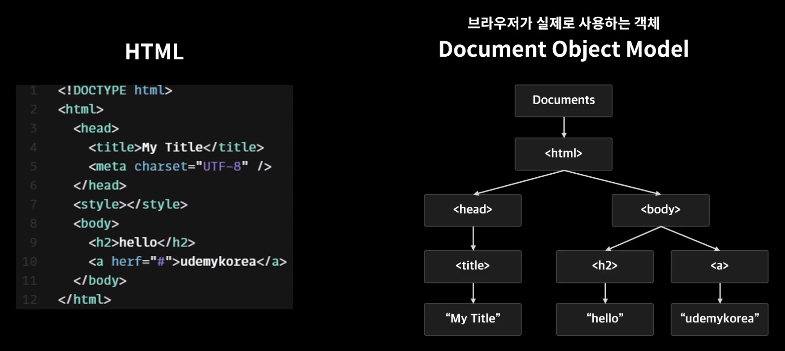
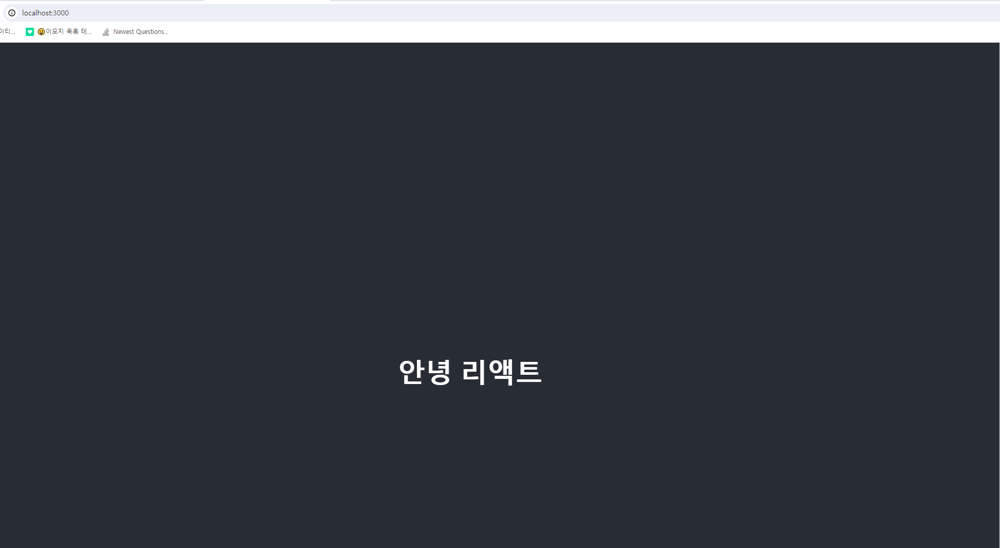

# React.js 기초
[한입 크기로 잘라 먹는 리액트(React.js) : 기초부터 실전까지](https://www.inflearn.com/course/%ED%95%9C%EC%9E%85-%EB%A6%AC%EC%95%A1%ED%8A%B8/dashboard)
**[4. React.js 기초]** 강의와 [React 문서](https://react.dev/learn)를 보고 정리한 내용입니다.

<br>


## 시작하기 전에
리액트 학습을 효율적으로 진행하기 위한 전제조건은 아래와 같다.

✅ HTML 및 CSS에 대한 기본 지식

✅ JavaScript 및 프로그매밍에 대한 기본 지식

✅ Node.js 그리고 npm

✅[DOM](https://www.taniarascia.com/introduction-to-the-dom/)에 대한 기본 이해

본 강의에선 <U>JavaScipt</U>에 대한 내용을 1강과 2강에서 Node.js와 npm을 3강에서 학습했다.

<br>

## 목차
4강의 내용은 아래와 같다.

1. why React
2. Create React App
3. JSX
4. State
5. Props


<br>

---

## 1. Why React

자바스크립트로 JSP에서 개발하면 되는데, 리액트를 <U>왜 배울까</U>?


| 특징                            | 기존 방식                                   | React                                   |
|---------------------------------|--------------------------------------------|-----------------------------------------|
| Component 기반의 라이브러리      | 모든 페이지에 대한 중복 수정 필요          | Component 재사용으로 중복 코드 감소    |
| 선언형 프로그래밍               | 명령형 프로그래밍                          | 선언형 프로그래밍으로 직관적이고 간결한 코드 작성 가능 |
| Virtual DOM vs 기존 DOM          | 전체 DOM을 새로 그리는 방식으로 비효율적  | 변경된 부분만 업데이트하는 Virtual DOM으로 성능 향상 |


위 표 내용을 정리하면 아래와 같다.

<br>

**React 사용 이유?**

1. React는 <U>Componet기반</U>의 UI <U>라이브러리</U>이기 때문이다.
- ***Component기반***이라는 의미는 공통적으로 사용하는 부분들을 재사용할 수 있게 개발한다는 의미다.
- ***라이브러리***의 의미는 소프트웨어 개발 시 사용되는 프로그램의 구성요소로, 공통으로 사용될 수 있는 기능들을 모듈화 한 것

<br>

2. React는 선언형 프로그래밍이다.
- 직관적이고 간결한 코딩을 할 수 있게한다.

<br>

3. Virtudal Dom
- Virtual Dom을 사용해 기존 Dom보다 우수한 성능을 보여준다.

<br>

*브라우저가 HTML 코드를 해석하는 그림*

<U>DOM(Document Object Model)</U> 이란 문서 객체 모델이란 뜻이며, 브라우저가 HTML을 해석할 수 있게 `Tree 형태로 변환시켜 놓은 객체`

기존 Dom의 동작 방식은 작은 변화에도 전체 DOM을 새로 그리는 비효율적인 방식을 사용하고 있고 이는 성능에 영향을 준다.

이를 개선하기 위해 리액트는 `Virtual Dom`을 사용한다.

<br>

=> <U>React를 배워야하는 이유</U>

**정리**
- React는 기존 프론트 개발의 단점을 보완한 라이브러리이다.
- 앞으로 개발하는데 있어서 위에 정리한 개념을 이해하고 사용한다면 리액트를 더 효율적으로 사용할 수 있을것이다.


---

***2.React App***

실제 본격적으로 **React App**을 생성하는 챕터

아래는**React App**에 핵심적인 라이브러리 몇개만 정리하겠음

<br>

✔️ React.js

Node 기반의 JavaScript UI 라이브러리

<br>

✔️ WebPack
 
 다수의 자바스크립트 파일을 하나의 파일로 합쳐주는 모듈 번들 라이브러리

<br>

 ✔️ Babel

JSX등의 쉽고 직관적인 자바스크립트 문법을 사용할 수 있도록 해주는 라이브러리

<br>

 ✔️ npx

Node.js 실행 패키지 도구로, 로컬에 설치된 패키지가 아니더라도 원격에서 패키지를 다운로드해서 실행할 수 있게 해주는 도구

<br>

 ✔️ jsx

자바스크립트 확장 문법이자, 자바스크립트와 HTML을 합쳐서 표현할 수 있는 문법

<br>

***React 실행***

1. Node 설치 확인

cmd 환경에서 node --version 을 통해 설치 여부 및 버전 정보를 확인한다

<br>

2. npx create-react-app react-exam1 명령어 입력

create-react-app 명령어를 사용하면 React App 실행에 필요한 초기 개발 환경 설정을 잡아주며 이를 보일러플레이트라고도 한다.

<br>

3. npm start

아래는 pacakge.json 파일의 일부이다.
``` 
... pas
  "scripts": {
    "start": "react-scripts start",
    "build": "react-scripts build",
    "test": "react-scripts test",
    "eject": "react-scripts eject"
  },

```
npm start 명령어를 사용할 수 있는 이유는 <U>package.json</U>의 scripts 부분에 

명령어가 설정되어 있기 때문이고 npm start 라는 명령어는 react-script build와 같은 의미로 지정되어 있어서 실행할 수 있는것

<br>

4. localhost:3000 확인



<br>

**정리**
- npx를 활용해 react 애플리케이션 환경을 간편하게 구축하고 실행할 수 있음
- react는 jsx 문법을 사용함

---
***3.jsx?***

자바스크립트의 확장 문법이자 React에서 주료 사옹하는 문법

React의 컴포넌트를 구성하는데 사용한다.

<br>

*jsx 예제 코드 1*
``` jsx
const MyHeader = () => {
    const headerTitle = "헤더";
    return <header>{headerTitle}</header>;
   
};
export default MyHeader;

```
위와 같이 html과 javascript를 혼합해서 사용하는 문법


<br>

*jsx 예제 코드 2*
``` jsx 
function App() {
  let name = "준현";


  const style = {
    App : {
      backgroundColor : "black",
    },
    h2: {
      color : "red",
    },
    bold_text : {
      color : "green",
    },
  };

  return (
    <div style={style.App} className="App">
      <MyHeader/>
      <header className="App-header">
        <h2 style={style.h2}> 안녕 리액트 {name} </h2>
        <b style={style.bold_text} id="bold_text"> React.js</b>
      </header>
    </div>
  );
}

```
jsx 문법을 사용했고 외부 css 파일을 import 하는 방식이 아닌 inline으로 스타일을 지정한 후 점표기법을 사용해 style을 지정할수도 있다.

<br>

*jsx 예제 코드 3*
``` jsx
  return (
    <div style={style.App} className="App">
      <MyHeader/>
        <h2 style={style.h2}> 안녕 리액트 {name} </h2>
        <b style={style.bold_text} id="bold_text">
          {name} : {name === "준현" ? "만든사람" : "외부인" }
        </b>
    </div>
  );
```
<U>삼항연산자</U>를 활용해 텍스트 랜더링도 편리하게 할 수 있음

<br>

**정리**
- jsx는 HTML과 Javascript를 혼합해서 사용할 수 있는 JavaScript 확장 문법이고 React에서 주로 사용한다.

---
***4.상태(State)***

계속해서 변화하는 특정 상태, 리액트는 상태에 따라 각각 다르게 관리하고 처리 할 수 있다.

<br>

*예제 코드*
``` jsx
import React, {userState} from 'react';  // 함수형 컴포넌트에서 상태를 사용하기 위한 함수
  ...
  ...
    const [count, setCount] = userState(0); // userState의 파라미터값은 초기값 정보

    const onIncrease = () => {
        setCount(count + 1);
    };

    const onDecrease = () => {
        setCount(count - 1);
    };

    return (
            <div>
                <h2> {count}</h2>
                <button onClick={onIncrease}>+</button> 
                <button onClick={onDecrease}>-</button>
            </div>
    )

```
위에서부터 코드를 보면 다음과 같다. 

<br>

`userState`가 반환하는 배열의 첫 번쨰 요소는 현재 상태 값이고, 두 번쨰 요소는 상태를 업데이트하는 함수이다.

button의 onclick에 직접 정의한 onIncrease와 onDecrease 함수가 작성되었고 상태를 업데이트하는 `setCount`의 파라미터에 상태르 업데이트하고 있다.

이로 인해, 초기 값 0이 버튼을 눌렀을 때 count 변수의 상태를 증가, 감소 시켜 값를 리턴하고 화면은 새로운 컴포넌트 정보를 *리랜더* 한다.

<br>

 ✔️ 리랜더

화면을 다시 그리는 작업

<br>

**정리**
- React의 대표적인 개념 중 하나로 상태라는 개념을 활용해 데이터를 다룰 수 있음

---
***5.Props?***

컴포넌트에게 데이터를 전달하는 가장 기본적이고 효율적인 방법

단일 데이터 전달을 *Prop*, 복수형 데이터 전달을 *Props*

<br>

``` jsx
// App.js 코드
<Counter {...counterProps}/>
...

<br>

// Counter.js
const Counter = ({initialValue}) => {

const [count, setCount] = useState(initialValue);
...
}
```
App.js 에서 counterProps라는 객체를 ***Spread***를 활용해 전달했고 Counter.js에선 ***비구조화 할당***을 통해 값을 받을 수 있다.

이를 활용해 전달받은 데이터로 새로운 기능을 처리 할 수 있고 이뿐만 아니라 컴포넌트 자체를 다른 컴포넌트의 Props로 전달 할 수도 있음


<br>

**정리**
- ***Props***는 컴포넌트에 데이터 또는 컴포넌트를 전달하는 방법
- 리액트의 ***상태(State)***, ***Props*** 는 리액트의 가장 핵심적인 개념이다.
- 리액트의 컴포넌트는 내가 가진 상태가 바뀔때, 전달받는 Proprs가 바뀔때마다, 내 부모가 리랜더 되면 리랜더 된다.


