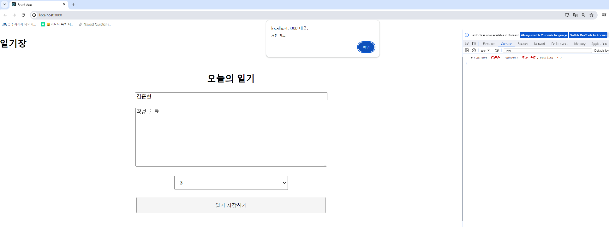
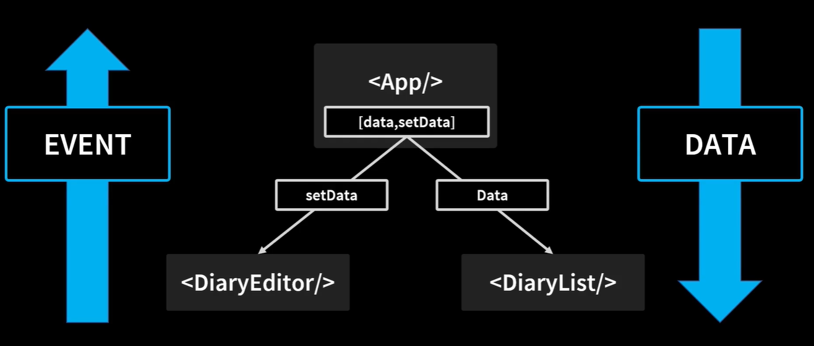

# 5강 간단한 일기장 만들기

이제부턴 React를 활용한 실습 프로젝트이다.

<br>

--- 

## 1.간단한 일기장 만들기 프로젝트


*완성 일기장 그림*

 

***정리***
-  ***상태(State)*** 와 ***Props*** 중요 
- ***Spread***, ***비구조화 할당*** 중요
- 코드는 간결하고 직관적으로 구현할 수 있다.

---

## 2. React에서 DOM 조작하기

 ✔️  DOM(Document Object Model)
문서 객체 모델은 XML이나 HTML 문서에 접근하기 위한 트리 형태의 인터페이스이다.

<br>

이 객체 모델은 문서 내의 모든 요소를 정의하고, 각각의 요소에 접근하는 방법을 제공합니다.

리액트를 사용하는 이유 중 하나인 Virtual Dom은 기존 작은 변화에도 DOM을 새로 그려야했던 단점을 보완한 강점을 가지고 있었다.

<br>
 

✔️ MutableReactObj

HTML, DOM 요소를 접근할 수 있게 한다.

예제 코드
``` jsx
import  {useRef} from "react"; // react에서 import

const authorInput = useRef(); // useRef를 할당

<input ref={authorInput}> 
</input>// 이후 authorInput(태그)에 접근 가능하게한다.

if(text.length < 2) authorInput.current.focus() // fouus 가능
```

</br>

***정리***
- useRef 를 활용해 HTML의 태그에 접근을 가능하게하고 이를 활용해 해당 input에 focus 처리를 할 수 있다.

---

## 3 ~ 6 배열 CRUD

React에서 데이터를 랜더링하고 CRUD 하는 작업에 대해 실습하는 챕터


***신규 데이터를 추가하는 프로세스***



가장 최상위로 `App` 하위 level로 `DiaraEditor`와 `DiaryList` 컴포넌트가 각각 분리되어 있다.

이렇게 이루어진 이유는 리액트는 `단방향 데이터 흐름` 을 가지고 있어 동일 레벨에선 데이터를 주고 받을 수 없기 떄문이다.

그러므로 신규 데이터를 추가하기 위해선 상위 컴포넌트인 App에서 이를 처리하고 관리해야 한다.

</br>

<U>App.js</U>

``` js
// 최상위 컴포넌트 App.js
  const [data,setData] = useState([]);

  const dataId = useRef(0);
  
  const onCreate = (author, content, emotion) => {
      const create_date = new Date().getTime();

      const newItem = {
        author,
        content,
        emotion,
        create_date,
        id : dataId.current
      }
      dataId.current ++;
      // 신규 데이터를 가장 앞에 보여주기 위해
      setData([newItem, ...data]);
  }

  return (
    <div className="App">
      <h2>일기장</h2>
      <DiaryEditor onCreate={onCreate}/>
      <DiaryList diaryList={data}/>
    </div>
  );

```
최상위 컴포넌트인 `App`에서 전역적으로 데이터를 관리할 `state`인 `data`와 상태변화 함수인 `setData`를 선언한다.

일기 데이터를 저장하므로 배열로 생성한다.

ID 처리를 위해 `useRef`를 활용해 dataId라는 변수를 선언했고 이를 이용해 데이터의 id값을 관리하고 있다.

신규 데이터를 가장 최신의 데이터로 보여주기 위해 setData 파라미터로 가장 먼저 넘겨주었고 기존 데이터와의 관리를 위해 `Spread` 연산자를 사용했다.

</br>

<U>DiaryEditor.js</U>

``` jsx
const DiaryEditor =  ({onCreate}) =>{
...
...

const handleSubmit = () => {

    if(state.author.length < 1) {
        authorInput.current.focus();
        return ;
    } else if(state.content.length < 5){
        contentInput.current.focus();
        return;
    }

    onCreate(state.author, state.content, state.emotion);        
    alert("저장 완료");
    setState({
        author : "",
        content : "",
        emotion : 1,
    });
};
```

`DiaryEditor.js` 에는 `Props`로 onCreate 를 사용해 데이터를 다시 넘겨주면 App.js에선 전역으로 사용한 `setDate` 이벤트가 발생하고

`Data` 의 상태가 변화하고 하위 컴포넌트인 `diaryList` 리랜더링 되어 데이터가 추가되는것이다.

</br>

---

***데이터 삭제 프로세스***


<U>App.js</U>
``` jsx
  ...
  const onDelete = (targetId) => {
    console.log(`${targetId}가 삭제 되었습니다.`);
    const afterDeleteDiaryList = data.filter((it) => it.id !== targetId);
    setData(afterDeleteDiaryList);
  }
  ...
  <DiaryList onDelete={onDelete} diaryList={data}/>
```

</br>


<U>DiaryItem 예제 코드</U>
``` jsx
        <button onClick={ () => {
            console.log(id);
            if(window.confirm(`${id}번째 일기를 정말 삭제하시겠습니까?`)){
                    onDelete(id);
            }
        }> 
        삭제하기 
        </button>
```

</br>

<U> DiaryList 코드 </U>
``` jsx
    return (
        // 데이터의 고유한 id를 설정하지 않으면 에러가 발생한다.
        // idx를 key정보로 설정하면 데이터 수정,삭제 시 에러가 발생할 수도 있음 그러므로 고유 키 정보를 key로 설정하는걸 권장한다.
        <div className ="DiaryList">
            <h2>일기 리스트</h2>
            <h4> {diaryList.length}개의 일기가 있습니다.</h4>
            <div>
                {diaryList.map((it) => (
                    <DiaryItem key ={it.id}{...it} onDelete = {onDelete}/>
                ))}
            </div>
    )
```
 
`DiaryItem`의 코드를 보면 페이지 하단에 위와 같이 삭제하기 버튼을 추가했다.

일반적으로 삭제는 클릭과 동시에 이루어지는게 아닌, 사용자에게 한번 더 검증을 하는게 일반적이기에 `confirm` 을 추가한후 App.js 에서 `Props`로 받은 `onDelete` state에 삭제할 게시글의 id를 넘겨줬다.

</br>

1. `App.js` 에서는 `onDelete`를 전역으로 선언후 `DiaryList` 컴포넌트에 넘겨준다.

2. `DiaryList`에서는 `DiaryItem`에 각각의 데이터에 대해 `onDelete` 를 넘겨준다

3. `DiaryItem`에서는 실제 넘겨받은 `onDelete` 함수에 사용자가 삭제하길 원하는 일기의 ID를 넘겨주는 기능을 처리한다.

4. 배열의 내장함수 `filter` 를 이용해 파라미터로 받은 data 배열을 제외한 신규 배열 정보를 다시 setData 상태로 업데이트 시킨다.

</br>

---

***데이터 수정 프로세스***

데이터는 위에서 아래로, 이벤트는 아래에서 위로를 생각해야한다.

<U>App.jsx</U>

```jsx
  const onUpdate = (targetId,updateContent) => {
    setData(
      // 삼항연산자 사용, 수정 대상이라면 새로운 콘텐츠로 업데이트하고 그렇지 않다면 기존 배열을 가져온 배열을 세팅 후 최종 배열 세팅한다.
      data.map((it) => 
        it.id === targetId ? {...it, content:updateContent}: it 
      )
    );
  };

```

최상위 컴포넌트에선 위와 같이 update기능에 실제 내릴 date를 처리한다.

앞서 삭제에서 `filter`를 사용한것과 달리 배열의 내장함수 `map`을 사용해 데이터를 처리했다.

</br>

✔️ filter

주어진 함수의 조건을 만족하는 배열의 요소들로 새로운 배열을 생성한다.

</br>

✔️ map

배열의 각 요소에 대해 주어진 함수를 호출하고, 각 호출의 결과를 모아 새로운 배열을 생성한다.

단순히 배열의 각 요소를 수정을 하려 한다면 `map` 을 사용하고, 특정 조건을 만족하는 요소를 걸러내고자 한다면 `filter`를 사용한다.


<U>DiaryList.js</U>

```jsx
        <div className ="DiaryList">
            <h2>일기 리스트</h2>
            <h4> {diaryList.length}개의 일기가 있습니다.</h4>
            <div>
                {diaryList.map((it) => (
                    <DiaryItem key ={it.id}{...it} onRemove = {onRemove} onUpdate={onUpdate}/>
                ))}
            </div>
        </div>

```
최상위 컴포넌트 `App.js`에서 `Props`로 전달받은 `onUpdate` 함수를 다시 `DiaryItem` 컴포넌트에 전달한다.


<U> DiaryItem.js </U>

```jsx

    const [isEdit, setIsEdit] = useState(false);
    
    // 반전연산, isEdit가 true일때 수정할 수 있도록 처리한다.
    const toggleIsEdit = () => {
        setIsEdit(!isEdit);
    }
    ...
    <div className="content">
    {isEdit ? (
            <>
              <textarea ref={localContentInput} 
              value={localContent}
              onChange={(e) => 
                {
                setLocalContent(e.target.value)}}
              />
            </>
        )   : (
            <> {content} </>
        )}     
    </div>
    ...
    {isEdit ? (
        <>
        <button onClick={handleQuitEdit}> 수정 취소 </button>
        <button onClick={handleCompleteEdit}>수정 완료</button>
        </>
    ) : ( 
        <>
        <button onClick={handleRemove}>삭제하기 </button>
        <button onClick={toggleIsEdit}>수정하기</button>
        </>
    )}
    ...
    const handleCompleteEdit = () => {
    const fixId = (`${id}` === "0") ? 1 : `${id}`;
    if(localContent.length < 5) {
        localContentInput.current.focus();
        return;
    }

    if(window.confirm(`${fixId}번째 일기를 수정하시겠습니까?`)){
        setIsEdit(false);
        onUpdate(id,localContent);
    }
}
```

`isEdit`라는 state 변수를 사용해 `setIsEdit` 를 활용해 변수값을 수정할 수 있게 했고 수정 여부를 판단할 수 있게 했다.

수정하기를 누르면 위 상태를 변화시켜 button 내용을 동적으로 변화 시킬수 있게 했고 `textarea`영역에 값을 입력할 수 있는 폼을 추가 시켰다.

</br>

<U>handleCompleteEdit</U>


```jsx
    const handleCompleteEdit = () => {
        const fixId = (`${id}` === "0") ? 1 : `${id}`;
        if(localContent.length < 5) {
            localContentInput.current.focus();
            return;
        }

        if(window.confirm(`${fixId}번째 일기를 수정하시겠습니까?`)){
            setIsEdit(false);
            onUpdate(id,localContent);
        }
    }
```

수정완료를 누르면 기존 textarea를 검증했듯이 동일하게 포커스를 사용했고 onUpdate 이벤트를 다시 상위 컴포넌트로 보내 데이터를 업데이트 할 수 있도록 했다.

---

## 7. React Lifecycle 제어하기

✔️ Lifecycle?

React 컴포넌트의 생애 주기(생명주기)


>탄생(화면에 나타나는 것 Mount) -> 변화(리렌더, Update) -> 죽음(화면에 사라짐, UnMount)

LifeCycle을 제어한다는것은 컴포넌트의 탄생부터 시작해서 스테이트나 프롭이 바뀌게 되어 일어나느 이런 업데이트나 변화를 거쳐 끝으론 죽음에 이르는 과정을 다루는것을 의미한다.

</br>

✔️ React Hooks

함수형 컴포넌트에서 클래스형 컴포넌트의 기능을 낚아채듯이 훔쳐와서 사용할 수 있는 기능

</br>

✔️ useEffect
``` jsx
useEffect (() => {
    // todo... callback 함수
}, []) // Dependency Array(의존성 배열), 이 배열 내에 들어있는 값이 변화하면 콜백 함수가 수행된다.

```

***컴포넌트 Mount 제어***

``` jsx
    useEffect(() => {
        console.log("Mount!!!");
    } ,[]) 
```

최초 랜더링 될때의 생명주기를 감지하고 이를 제어한다. 파라미터로 빈 배열을 전달한다는것은 최초 한번 특정 작업을 수행하고자 할때 사용한다. 

최초 한번만 실행되므로 불필요한 랜더링이 발생하지 않고 성능을 최적화 할 수 있다.

</br>

***컴포넌트 Update 제어***

``` jsx
    const [count,setCount] = useState(0);

    useEffect(() => {
        console.log("update"); // 컴포넌트의 변경 감지
    })

    useEffect(() => {
        console.log(`count is update : ${count}`);
        if(count > 5){
            alert(`count가 5를 넘었습니다. 따라서 1로 초기화합니다.`);
            setCount(1);
        }
    },[count]); // count state의 변경 감지
```

의존성 배열로 아무정보도 전달하지 않으면 해당 컴포넌트의 변경을 감지한다.

특정 state의 변경을 감지하고 처리하기 위해선 파라미터로 state 지정해서 사용할 수 있다.

예시코드는 count의 상태가 5가 넘었을 경우 alert를 보여주고 다시 1로 상태를 변경하게 했다.

</br>

***컴포넌트 UnMount 제어***

```jsx
    useEffect(() => {
      console.log("Mount !!");
  
      // Cleanup function
      return () => {
        console.log("Unmount !!");
      };
    }, []); // 빈 배열이므로 컴포넌트가 마운트되었을 때만 실행
```

</br>

---
## 8. React에서 API 호출하기

***<U> API 호출 예제</U>***

```jsx
  const getData = async () => {
    const res = await fetch("https://jsonplaceholder.typicode.com/comments")
            .then((res) => res.json());
    
    const initData = res.slice(0,5).map((it) => {
        return {
          author : it.email,
          content : it.body,
          emotion : Math.floor(Math.random() * 5) +1,
          create_date : new Date().getTime(),
          id : dataId.current++
      }
    })

    setData(initData);
  };

  // 최초 랜더링 되었을떄 한번 실행
  useEffect(() => {
    getData();
  },[]

```

1. https://jsonplaceholder.typicode.com/comments 호출을 위해 자바스크립트 내장 API 호출 함수 `fetch` 사용

2. 응답을 받은 후 처리 하기 위한 동기 키워드 `async`와 `await`사용

3. 많은 응답 중 5개만 가져오기 위해 slice 사용, map을 사용해 state 변수에 값 할당

4. 할당한 변수 initData를 setData에 할당

5. 최초 랜더링 된 mount 시점에 실행시키기 위해 `useEffect` 사용


---

## 10. useMemo

가장 많이 하는 실수 

✔️ useMemo

연산을 최적화하기 위해 메모이제이션 기능을 제공하는 리액트 함수

어떤 함수가 있고 그 함수가 어떤 값을 리턴하고 있는데 그 리턴까지의 연산을 최적화하고 싶다면 어떤 dependency array에 의해 최적화할지만 정해주면 

연산 및 호출을 최적화 할 수 있다.

</br>

***useMemo 많이 하는 실수***
```
getDiaryAnalysis is not a function
TypeError: getDiaryAnalysis is not a function
```

</br>

`useMemo`로 함수를 감싸고 dependency array를 전달하면 더이상 전달한 함수는 더이상 함수가 아니다.

던지고 나면 응답값으로 콜백함수가 아닌 값을 전달받게 된다.

그러므로 함수가 아닌 값으로 처리한다.

---

## 11. React.memo

함수형 컴포넌트에 업데이트 조건을 거는 기능

필요한 부분에 대해서만 랜더링 하고 연산의 낭비를 막기 위한 기능


``` jsx
const TextView = React.memo(({ text }) => {
    useEffect(()=> {
        console.log(`Update ::  TEXT : ${text}`);
    })
    return <div>{text}</div>;
});

const CountView = React.memo(({ count }) => {
    useEffect(()=> {
        console.log(`Update ::  count : ${count}`);
    })
    return <div>{count}</div>;
})
```

원래라면 useEffect는 해당 컴포넌트에서의 state가 바뀔떄마다 리랜더링 된다.

하지만 `React.memo`를 사용하면 고차 컴포넌트로 반환받게 된다. 고차 컴포넌트로 바뀜으로써 `props`의 변화에만 영향을 받게 할 수 있게한다.

</br>

**객체의 비교**
```jsx
const CounterA = React.memo(({count}) => {

    useEffect(() => {
        console.log(`CounterA Update - count: ${count}`);
    })

    return <div>{count}</div>
})

const CounterB = React.memo(({obj}) => {

    useEffect(() => {
        console.log(`CounterB update - count : ${obj.count}`);
    })

    return <div>{obj.count}</div>
})

const areEqual = (prevProps, nextProps) => {
    if(prevProps.obj.count === nextProps.obj.count){
        return true;
    }
    return false; // 이전 프롭스와 다음 프롭스가 같다 -> 리랜더링을 일으키지 않는다. , if false => 리랜더링을 일으켜야한다.
}

```
obj는 객체이고 자바스크립트에서 객체 비교는 해당 객체가 가지고 있는 주소값으로 비교를 하게 된다.

즉 얕은 비교를 하게 되는데, 이로 인해 객체는 `areEqual` 과 같은 함수를 활용해 내부 값을 비교하지 않으면 실제 내부 값이 변경되지 않더라도

항상 다른 객체로 인식하게 된다.

이를 방지하기 위해 `React.memo` 에선 객체의 비교 함수를 파라미터로 받을 수 있게 했고 실제 객체 내부 값 비교 함수를 생서 후 파라미터로 넘겨주면 

객체에 대해서도 불필요한 리랜더링을 대처 할 수 있다.

---

## 12. useCallBack

`메모이제이션`된 콜백 함수를 반환 해주는 리액트의 기능(값이 아닌 함수 반환)

</br>

**사용 이유**

리액트의 컴포넌트의 리랜더링의 조건은 본인이 가진 `State`가 변하거나 `Prop`이 변화가 생기는 경우이다.

예제 코드에선 상위 컴포넌트인 App.js에서 다이어리 생성을 위한 콜백함수 `onCreate`를 하위 컴포넌트로 전달했고

이를 전달받은 DiaryEidtor.js 에선 신규 게시글 추가에 대한 처리 이벤트를 다시 App.js에 전달했고

App.js에선 전달받은 파라미터로 신규 데이터를 추가할 수 있게 했다.


</br>

하지만 이로인해 앱 컴포넌트가 랜더링 될 때마다 `onCreate` 함수는 계속 다시 만들어져 랜더링이 계속 발생하고 있다.

내용을 삭제하거나 추가할때에도 앱 컴포넌트는 계속 재생성되서 불필요한 리랜더링이 발생하게 된다.

이를 최적화하기 위해선 `useCallBack`을 사용할 수 있고 이전에 처리한 `useMemo` 를 사용할 수 없는 이유는 이 녀석은 함수가 아닌 값을 반환하기 때문에

원본 그대로 하위 컴포넌트로 보내 처리하기 위해선 값이 아니라 콜백 함수 그대로 사용해야한다.

</br>

1. 최적화의 시작은 export component를 `export React.memo(Componet)` 

2. 최적화 콜백 함수 추가

``` jsx
  const onCreate = useCallback(
    (author, content, emotion) => {
      const create_date = new Date().getTime();

      const newItem = {
        author,
        content,
        emotion,
        create_date,
        id : dataId.current
      };
      dataId.current ++; 
      // 신규 데이터를 가장 앞에 보여주기 위해
      setData((data) => [newItem, ...data]);
    },
    []  
  )
```
---
## 13. useReducer

리액트에서 상태관리를 돕는 리액트 `Hook`이다

⚡ Hook?

Hook은 함수 컴포넌트에서 React state와 생명주기(lifeCycle feature)를 연동할 수 있게 해주는 함수

</br>

***사용 이유***

useReducer를 사용하면 복잡하고 긴 상태 변화 로직을 클래스와 분리해 바깥에서 이를 처리할 수 있게 해준다.

함수안에 코드가 긴것은 결코 좋은 현상이 아님.

</br>

***사용 방법***

1. const [data,dispatch] = useReducer(reducer, []);  

구조 분해 할당으로 받게되는 데이터와 실제 상태변화 일으키는 dispatch 함수

2. useReducer

</br>

*예제 코드*

```jsx
const reducer = (state,action) => {
  switch(action.type){
    case `INIT` : {
      return action.data;
    }
    case `CREATE` : {
      const created_date = new Date().getTime();
      const newItem = {
        ...action.data,
        created_date,
      };
      return [newItem, ...state];
    }

    case `REMOVE` : {
      return state.filter((it) => it.id !== action.targetId);
    }

    case `EDIT`:{
      return state.map((it) => 
      it.id === action.targetId ? 
      {...it, content : action.updateContent} : it
      )
    }

    default :
      return state;
  }
}
```

위와 같이 함수 `state`를 분리해 사용할 수 있게 한다.

</br>

3. 기존 seTData(data)

*수정 코드*
```jsx

// 최초 생성 
dispatch({type : "INIT", data:initData});

// 추가
  const onCreate = useCallback(
    (author, content, emotion) => {
      // 신규 데이터를 가장 앞에 보여주기 위해
      dispatch({
        type:"CREATE",
        data:{author,content,emotion, id:dataId.current}}
        );

      dataId.current ++; 
    },
    []  
  ) 

// 삭제
  const onRemove = useCallback((targetId) => {
    dispatch({type:"REMOVE", targetId});
  }
  ,[]
  )

// 수정
  const onUpdate = useCallback((targetId,updateContent) => {

    dispatch({type:"EDIT", targetId, updateContent});
    },[]
  );
```

이처럼 `useReducer`를 사용해 위와 같이 복잡한 상태 변화 로직을 분리해 처리할 수 있다.

</br>

---

## 14. Context

컴포넌트 트리에 데이터를 공급하는 방법


만약 우리가 최상단에 있는 함수를 하위 자손에 넘겨주기 위해선 불필요하게 하위 자식에 넘겨주고 그 자식이 자손에게 넘겨줘야하는

소위 말하는 Props Driling 현상이 있었다.

</br>

react에선 이러한 데이터를 전체적으로 관리해주는 api를 제공하는데 그 녀석이 바로 `Context Provider` 이다.

```js
const MyContext = React.createContext(defaultValue);

// Context Provider를 통한 데이터 공급
<MyContext.Provider value={전역으로 전달하고자하는 값}>
  {/* 이 Context안에 위치할 자식 컴포넌트들 */}
</MyContext.Provider>
```

위 처럼 react에 createContext를 사용해 전역적으로 사용할 수 있는 `MyContext` 라는 객체를 생성할 수 있고

이 안에 있는 `Provider` 를 활용해 자식으로 존재하기만 하면 모든 컴포넌트는 이 프로바이더가 전달하는 값을 사용할 수 있다. 

</br>


``` jsx
// export
export const DiaryStateContext = React.createContext();

// 자식,자손에서 import
import { DiaryStateContext } from './App.js';

```

외부(자식,자손)에서 이 `Context` 에 접근하기 위해선 `export`를 해야한다.

export const로 내보내기가 된 컴포넌트들은 비구조화 할당을 통해서만 import 할 수 있다.

</br>

실제 export 할 데이터를 담는 방법은 아래와 같이 한다.

``` jsx
  <DiaryStateContext.Provider value = {data}>
  <DiaryList onEdit = {onEdit} onRemove={onRemove} diaryList />
  </DiaryStateContext.Provider>
```

위와 같이 하면 `diaryList` 에선 `data`를 `Props`를 받을 필요가 없다.

`DiaryStateContext`에 데이터가 담겨 있기 때문이고 이를 접근해 가져오기만 하면 되기 때문이다.

``` jsx
import { useContext } from 'react';
import { DiaryStateContext } from './App.js';
```

우선  자식 컴포넌트가 컨텍스트의 값을 사용하려면, 해당 컨텍스트를 자식 컴포넌트에서 `UseContext` 훅을 사용해 가져와야한다.

실제 `DiaryList` 의 컴포넌트의 hooks 부분에 Context 내부에 실제 Data가 담겨 있다.

그러므로 위 2개를 `import`하고 데이터 랜더링은 아래와 같이 한다.

</br>

``` jsx
const list = useContext(DiaryStateContext);

{list.map((it) => {
  <div>
  <DiaryItem key={it.id} {...it} />
  </div>
})}

```
위와 같이 `useContext(DiaryStateContext)` 를 사용하면 일반 `Props` 로 전달받은것과 동일하게 사용할 수 있다.


</br>


*** Props Driling ***

앞서 진행했던 작업은 상위 컴포넌트가 자식에게 `Props` 에서 `Context` 로 접근해 데이터를 랜더링 하는 작업이었다.

그렇다면 상위 컴포넌트의 `DiaryStateContext`에 모든 `Props` 를 넘겨 접근해서 사용하게 하면 될까?


</br>

결론은 그렇지 않다. 

왜냐하면 Provider는 컴포넌트이기 때문에 여러 props를 넘겨주게 되면 데이터 state가 바뀔때마다 리랜더링이 발생하며

앞서 작업했던 최적화가 의미가 없어지게 된다.

그러므로 이럴 땐 컨텍스트를 중첩으로 사용해 처리해야한다.

하나의 `Context` 는 하나의 `State` 전달을 이해 사용해야한다.

</br>

``` jsx

export const DiaryStateContext = React.createContext();
export const DiaryDispatchContext = React.createContext();
  ...  
  const memoizedDispatches = useMemo(() => {
    return {onCreate,onRemove,onUpdate}
  },[]);

  return (
    <DiaryStateContext.Provider value={data}>
      <DiaryDispatchContext.Provider value ={memoizedDispatches}>
    <div className="App">
      {/* <OptimizeTest/> */}
      <DiaryEditor onCreate={onCreate}/>
      {/* <div> 전체일기 : {data.length} </div>
      <div> 기분 좋은일기 개수 : {goodCount}</div>
      <div> 기분 나쁜일기 개수 : {badCount}</div>
      <div> 기분 좋은일기 비율 : {goodRatio}</div> */}
      <DiaryList onUpdate={onUpdate} onRemove={onRemove} />
    </div>
    </DiaryDispatchContext.Provider> 
    </DiaryStateContext.Provider>
  );

```

일반 함수에 데이터를 담아 value로 넘기는것이 아닌 `useMemo` 를 사용하는 이유는 넘겨주는 상위 컴포넌트의 재생성이 될 떄마다

하위 객체(onCrate,onRemove...)도 다시 재생성이 된다. 

그렇기 때문에 `useMemo` 를 활용해서 재생성 되지 않게 객체로 묶어 주고 `Provider`의 value로 넘겨줘야한다.

</br>

```jsx
    const {onRemove} = useContext(DiaryDispatchContext);
    const {onUpdate} = useContext(DiaryDispatchContext);
```

동일하게 import 해서 기존 컴포넌트의 기능을 대체할 수 있다.

이렇게 하면 `Props Driling` 현상을 해결하며 기능을 정상적으로 수행하도록 할 수 있다.


</br>

***정리***
- 쉽지 않다.

</br>

---
## 자료출처
- [인프런 - 한입리액트](https://www.inflearn.com/course/%ED%95%9C%EC%9E%85-%EB%A6%AC%EC%95%A1%ED%8A%B8/news?gad_source=1&gclid=CjwKCAiApuCrBhAuEiwA8VJ6JqXDJLdwPCKfm1CpJ8y9foV_fBud8G_hRX8rebgBmdxIOycyFLNN5xoCMTgQAvD_BwE)
 


